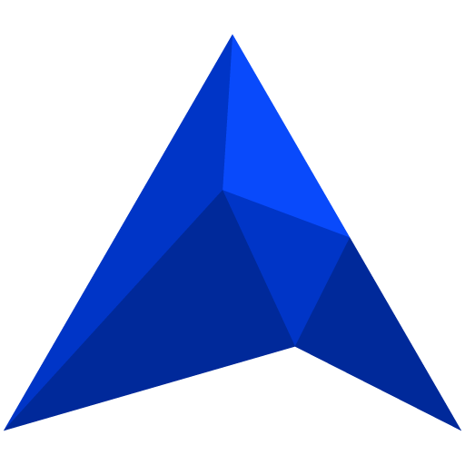

<div id="top"></div>

<!-- PROJECT SHIELDS -->
<!--
*** I'm using markdown "reference style" links for readability.
*** Reference links are enclosed in brackets [ ] instead of parentheses ( ).
*** See the bottom of this document for the declaration of the reference variables
*** for contributors-url, forks-url, etc. This is an optional, concise syntax you may use.
*** https://www.markdownguide.org/basic-syntax/#reference-style-links
-->
[![Contributors][contributors-shield]][contributors-url]
[![Forks][forks-shield]][forks-url]
[![Stargazers][stars-shield]][stars-url]
[![Issues][issues-shield]][issues-url]
[![MIT License][license-shield]][license-url]
<!--[![LinkedIn][linkedin-shield]][linkedin-url]-->


<!-- PROJECT LOGO -->
<br />
<div align="center">
  <a href="https://github.com/kborling/upkeep">
    
  </a>

<h3 align="center">Upkeep</h3>

  <p align="center">
    Upkeep your websites and web applications with ease from the comfort of the command line.
    <br />
    <a href="https://github.com/kborling/upkeep"><strong>Explore the docs »</strong></a>
    <br />
    <br />
    <a href="https://github.com/kborling/upkeep">View Demo</a>
    ·
    <a href="https://github.com/kborling/upkeep/issues">Report Bug</a>
    ·
    <a href="https://github.com/kborling/upkeep/issues">Request Feature</a>
  </p>
</div>


<!-- TABLE OF CONTENTS -->
<details>
  <summary>Table of Contents</summary>
  <ol>
    <li>
      <a href="#about-the-project">About The Project</a>
      <ul>
        <li><a href="#built-with">Built With</a></li>
      </ul>
    </li>
    <li>
      <a href="#getting-started">Getting Started</a>
      <ul>
        <li><a href="#prerequisites">Prerequisites</a></li>
        <li><a href="#installation">Installation</a></li>
      </ul>
    </li>
    <li><a href="#usage">Usage</a></li>
    <li><a href="#roadmap">Roadmap</a></li>
    <li><a href="#contributing">Contributing</a></li>
    <li><a href="#license">License</a></li>
    <li><a href="#contact">Contact</a></li>
    <li><a href="#acknowledgments">Acknowledgments</a></li>
  </ol>
</details>


<!-- ABOUT THE PROJECT -->
## About The Project

[![Product Name Screen Shot][product-screenshot]](https://example.com)

<p align="right">(<a href="#top">back to top</a>)</p>


### Built With

* [Rust](https://www.rust-lang.org/)

<p align="right">(<a href="#top">back to top</a>)</p>


<!-- GETTING STARTED -->
## Getting Started

This is an example of how you may give instructions on setting up your project locally.
To get a local copy up and running follow these simple example steps.

### Prerequisites

This is an example of how to list things you need to use the software and how to install them.

### Installation

1. Clone the repo
   ```sh
   git clone https://github.com/kborling/upkeep.git
   ```

<p align="right">(<a href="#top">back to top</a>)</p>


<!-- USAGE EXAMPLES -->
## Usage

Use this space to show useful examples of how a project can be used. Additional screenshots, code examples and demos work well in this space. You may also link to more resources.

_For more examples, please refer to the [Documentation](https://example.com)_

<p align="right">(<a href="#top">back to top</a>)</p>


<!-- ROADMAP -->
## Roadmap

- [] Finish menu and options
  - [] Read SSH config file
  - [] Build connection options
- [] Add Wordpress integration
    - [] Update Core
    - [] Update Themes
    - [] Update Plugins

See the [open issues](https://github.com/kborling/upkeep/issues) for a full list of proposed features (and known issues).

<p align="right">(<a href="#top">back to top</a>)</p>


<!-- CONTRIBUTING -->
## Contributing

Contributions are what make the open source community such an amazing place to learn, inspire, and create. Any contributions you make are **greatly appreciated**.

If you have a suggestion that would make this better, please fork the repo and create a pull request. You can also simply open an issue with the tag "enhancement".
Don't forget to give the project a star! Thanks again!

1. Fork the Project
2. Create your Feature Branch (`git checkout -b feature/AmazingFeature`)
3. Commit your Changes (`git commit -m 'Add some AmazingFeature'`)
4. Push to the Branch (`git push origin feature/AmazingFeature`)
5. Open a Pull Request

<p align="right">(<a href="#top">back to top</a>)</p>


<!-- LICENSE -->
## License

Distributed under the GPLv3 License. See `LICENSE` for more information.

<p align="right">(<a href="#top">back to top</a>)</p>


<!-- CONTACT -->
## Contact

Kevin Borling - kborling@protonmail.com

Project Link: [https://github.com/kborling/upkeep](https://github.com/kborling/upkeep)

<p align="right">(<a href="#top">back to top</a>)</p>


<!-- ACKNOWLEDGMENTS -->
## Acknowledgments

<!-- * []() -->
<!-- * []() -->
<!-- * []() -->

<p align="right">(<a href="#top">back to top</a>)</p>


<!-- MARKDOWN LINKS & IMAGES -->
<!-- https://www.markdownguide.org/basic-syntax/#reference-style-links -->
[contributors-shield]: https://img.shields.io/github/contributors/kborling/upkeep.svg?style=for-the-badge
[contributors-url]: https://github.com/kborling/upkeep/graphs/contributors
[forks-shield]: https://img.shields.io/github/forks/kborling/upkeep.svg?style=for-the-badge
[forks-url]: https://github.com/kborling/upkeep/network/members
[stars-shield]: https://img.shields.io/github/stars/kborling/upkeep.svg?style=for-the-badge
[stars-url]: https://github.com/kborling/upkeep/stargazers
[issues-shield]: https://img.shields.io/github/issues/kborling/upkeep.svg?style=for-the-badge
[issues-url]: https://github.com/kborling/upkeep/issues
[license-shield]: https://img.shields.io/github/license/kborling/upkeep.svg?style=for-the-badge
[license-url]: https://github.com/kborling/upkeep/blob/master/LICENSE.txt
[linkedin-shield]: https://img.shields.io/badge/-LinkedIn-black.svg?style=for-the-badge&logo=linkedin&colorB=555
[linkedin-url]: https://linkedin.com/in/kevinborling
[product-screenshot]: images/screenshot.png
